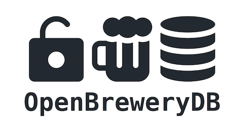

# 🍻 Open Brewery DB Dataset
<!-- ALL-CONTRIBUTORS-BADGE:START - Do not remove or modify this section -->

<!-- ALL-CONTRIBUTORS-BADGE:END -->

This is the open-source dataset for the [Open Brewery DB API](https://www.openbrewerydb.org/) which is served by a [REST API built with Ruby on Rails](https://github.com/chrisjm/openbrewerydb-rails-api)

## 🎯 Purpose

Provide an approval-based pipeline to update the dataset and API.

## 🗄 Data Formats

* [CSV](breweries.csv)
* [JSON](breweries.json)

## 🚛 Roadmap

| Task | Status |
| --- | --- |
| ✅ | 📤 Release dataset in JSON and CSV |
| ✅ | ⚙️ Task > Export JSON (/breweries.csv ➡️ /breweries.json) |
| ✅ | ⚙️ Task > Split CSV (/breweries.csv ➡️ /data) |
| ✅ | ⚙️ Task > Combine CSV (/data ➡️ /breweries.csv) |
| ✅ | ⚙️ Github Action > Validate Data |
|  | ⚙️ Github Action > Update Open Brewery DB API [#12](https://github.com/openbrewerydb/openbrewerydb/issues/12) |
|  | 🤖 Unit Tests > Tasks |

## 🤝 Contributing

For information on contributing to this project, please see the [contributing guide](CONTRIBUTING.md) and our [code of conduct](CODE_OF_CONDUCT.md).

## 👾 Community

* [Join the Newsletter](http://eepurl.com/dBjS0j)
* [Join the Discord](https://discord.gg/SHtpdEN)

## 📫 Feedback

Any feedback, please [email me](mailto:chris@openbrewerydb.org).

Cheers! 🍻

## Contributors ✨

Thanks goes to these wonderful people ([emoji key](https://allcontributors.org/docs/en/emoji-key)):

<!-- ALL-CONTRIBUTORS-LIST:START - Do not remove or modify this section -->
<!-- prettier-ignore-start -->
<!-- markdownlint-disable -->
<table>
  <tr>
    <td align="center"><a href="https://theputnams.net/mike/"> <b>Mike Putnam</b></a> <a href="#data-mikeputnam" title="Data">🔣</a></td>
    <td align="center"><a href="https://andrewbarber.me/"> <b>Andrew A. Barber</b></a> <a href="#data-AndrewBarber" title="Data">🔣</a></td>
    <td align="center"><a href="http://www.therearefourmics.com/"> <b>Jason Allen</b></a> <a href="#data-jallend1" title="Data">🔣</a></td>
    <td align="center"><a href="https://github.com/Juicob"> <b>Juicob</b></a> <a href="#data-Juicob" title="Data">🔣</a></td>
    <td align="center"><a href="https://github.com/wkarney"> <b>Will Karnasiewicz</b></a> <a href="#data-wkarney" title="Data">🔣</a></td>
    <td align="center"><a href="https://dvavs.github.io/"> <b>Dylan T. Vavra</b></a> <a href="#data-dvavs" title="Data">🔣</a></td>
    <td align="center"><a href="https://github.com/amadisonm1209"> <b>Madison Martinez</b></a> <a href="#data-amadisonm1209" title="Data">🔣</a></td>
  </tr>
  <tr>
    <td align="center"><a href="https://github.com/danieleremchuk"> <b>Daniel Eremchuk</b></a> <a href="#data-danieleremchuk" title="Data">🔣</a></td>
    <td align="center"><a href="https://github.com/alexchong"> <b>Alex Chong</b></a> <a href="#data-alexchong" title="Data">🔣</a></td>
    <td align="center"><a href="https://www.jackofalladmins.com/"> <b>Matt S</b></a> <a href="#data-MStewGT" title="Data">🔣</a></td>
    <td align="center"><a href="https://www.linkedin.com/in/samuel-rusher/"> <b>Samuel Rusher</b></a> <a href="#data-srusher" title="Data">🔣</a></td>
    <td align="center"><a href="https://github.com/EACaraway"> <b>Evan Caraway</b></a> <a href="#data-EACaraway" title="Data">🔣</a></td>
    <td align="center"><a href="https://github.com/tylerkkp"> <b>Tyler K Kuromiya Parker</b></a> <a href="#data-tylerkkp" title="Data">🔣</a></td>
    <td align="center"><a href="https://github.com/kendellmendoza"> <b>kendellmendoza</b></a> <a href="#data-kendellmendoza" title="Data">🔣</a></td>
  </tr>
</table>

<!-- markdownlint-restore -->
<!-- prettier-ignore-end -->

<!-- ALL-CONTRIBUTORS-LIST:END -->

This project follows the [all-contributors](https://github.com/all-contributors/all-contributors) specification. Contributions of any kind welcome!